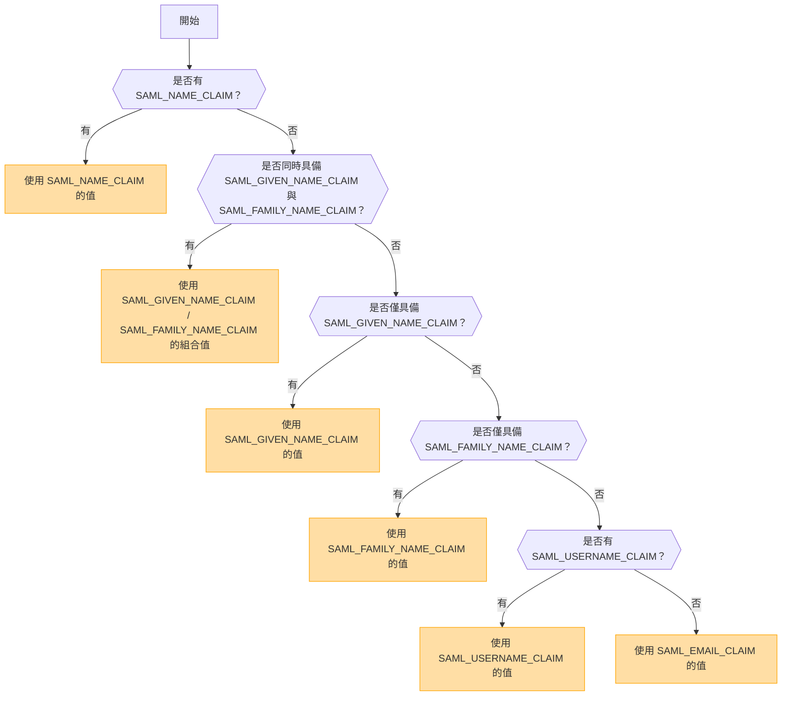

## 概覽

SAML (Security Assertion Markup Language) 是一種廣泛使用的身份驗證協定，支援單一登入 (SSO)。它允許使用者只需在身份供應商 (IdP) 驗證一次，即可存取多個服務，而無需重複登入。

<Callout type="warning" title="不支援單一登出 (SLO)">
在此實作中不支援單一登出 (Single Logout, SLO)。
</Callout>

<Callout type="warning" title="OpenID 與 SAML 互斥">
如果啟用了 OpenID 身份驗證，SAML 身份驗證將自動停用。

同一時間僅能啟動一種身份驗證方法。
</Callout>

## 根據環境變數啟動身份驗證方法

下表顯示了根據環境變數設定所啟用的身份驗證方法：

|   OIDC   |   SAML   | 啟動的身份驗證方法 |
| -------- | -------- | ---------------------------- |
| ✅已啟用  | ❌已停用 | OpenID Connect (OIDC)        |
| ❌已停用 | ✅已啟用  | SAML                         |
| ✅已啟用  | ✅已啟用  | OpenID Connect (OIDC)        |
| ❌已停用 | ❌已停用 | 未啟用任何身份驗證           |

## SAML 憑證格式與配置

環境變數 `SAML_CERT` 用於指定身份供應商 (IdP) 的簽署憑證，以便驗證 SAML 回應。此憑證必須以 **PEM 格式** 提供，並可透過以下方式之一指定：

### 作為檔案路徑（相對或絕對路徑）

如果 `SAML_CERT` 設定為檔案路徑，應用程式將從指定的檔案載入憑證。支援 **相對路徑** 與 **絕對路徑**。

```env
# 相對路徑（相對於應用程式根目錄解析）
SAML_CERT=idp-cert.pem

# 絕對路徑
SAML_CERT=/path/to/idp-cert.pem
```

**範例檔案內容 (`idp-cert.pem`)：**

```
-----BEGIN CERTIFICATE-----
MIIDazCCAlOgAwIBAgIUKhXaFJGJJPx466rl...
-----END CERTIFICATE-----
```

### 作為單行 PEM 字串

憑證也可以作為 **單行 PEM 字串**（Base64 編碼，不含換行符號）提供。

```env
SAML_CERT="MIICizCCAfQCCQCY8tKaMc0BMjANBgkqh...W=="
```

當直接將憑證儲存在環境變數中時，此格式非常有用。

### 作為多行 PEM 字串（使用 
 轉義序列）

憑證也可以作為 **多行 PEM 字串** 提供，其中換行符號以 
 表示。

```env
SAML_CERT="-----BEGIN CERTIFICATE-----
MIIDazCCAlOgAwIBAgIUKhXaFJGJJPx466rl...
-----END CERTIFICATE-----
"
```

當在 .env 檔案中配置憑證並希望保留完整的 PEM 結構時，此格式非常有用。

### 憑證格式要求
- 憑證 **必須始終為 PEM 格式**（Base64 編碼的 X.509 憑證）。
- 若以檔案形式提供，必須符合有效的 **RFC7468 嚴格文本訊息 PEM 格式**。
- 使用單行憑證時，請確保數值中 **沒有換行符號**。
- 使用多行字串時，請確保換行符號以 **
** 轉義序列表示。

如需更多詳情，請參閱 [node-saml 文檔](https://github.com/node-saml/node-saml/tree/master?tab=readme-ov-file#configuration-option-idpcert)。


## 根據 SAML 屬性決定顯示名稱的流程


在 SAML 身份驗證中，顯示名稱是根據下列流程決定的：



### 決定規則

1. 若提供 `SAML_NAME_CLAIM`，則將其值作為顯示名稱。
2. 若同時提供 `SAML_GIVEN_NAME_CLAIM` 與 `SAML_FAMILY_NAME_CLAIM`，則將它們的值串接作為使用者名稱。
3. 若僅提供 `SAML_GIVEN_NAME_CLAIM`，則使用其值。
4. 若僅提供 `SAML_FAMILY_NAME_CLAIM`，則使用其值。
5. 若提供 `SAML_USERNAME_CLAIM`，則使用其值。
6. 若上述屬性皆未提供，則使用 `SAML_EMAIL_CLAIM` 作為顯示名稱。

透過遵循此流程，即可在 SAML 身份驗證期間決定合適的使用者名稱。

## 配置範例
  - [Auth0](/docs/configuration/authentication/SAML/auth0_zh_TW)
